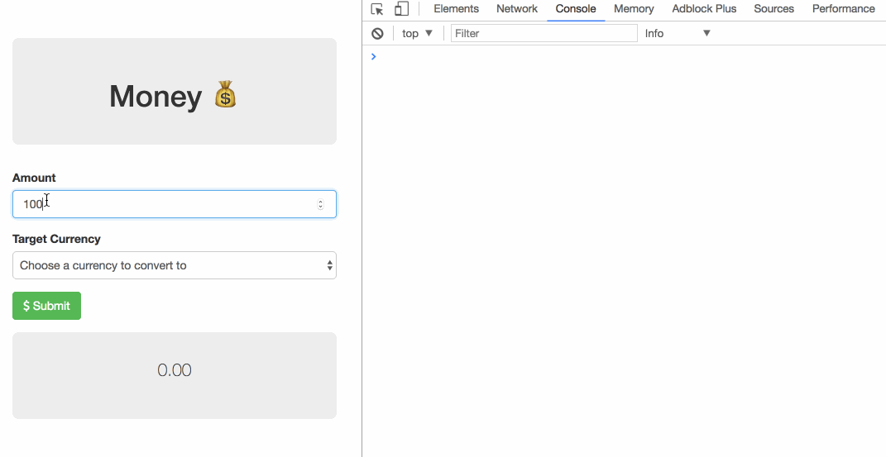

# Currency Conversion app

We'll be using the following API to get currency conversion rates:

-  http://fixer.io/

## Instructions

- Make an API call to the following URL to get all of the current rates for conversion from CAD
    - https://api.fixer.io/latest?base=CAD
- Automagically populate the `<select>` menu with all of the available rates
- When the user submits the form for a conversion, show them the rate in the jumbotron below

You should end up with something like the following GIF:

